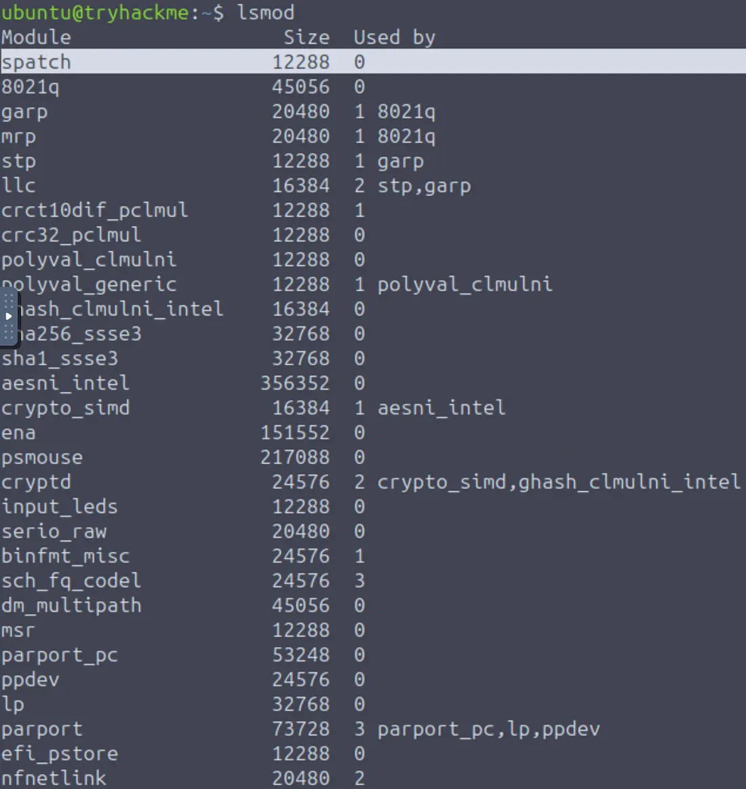
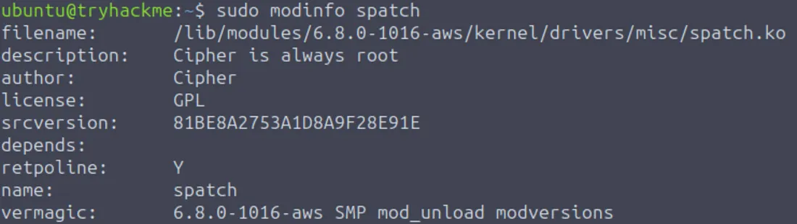
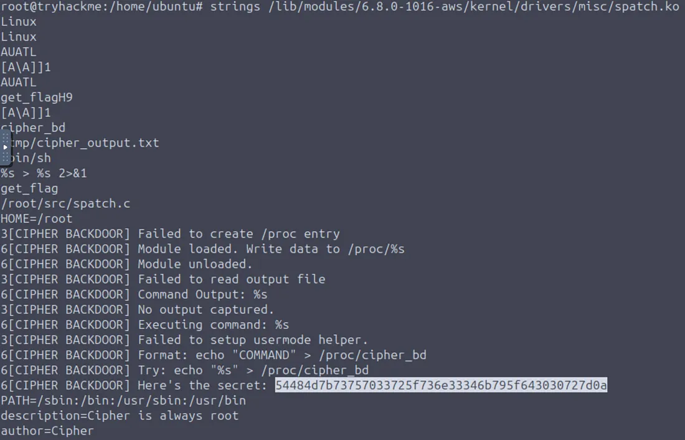

# Sneaky Patch — Write-up

---

## Overview

- Platform: TryHackMe  
- Room: Sneaky Patch  
- Difficulty: Easy  
- Objective: Identify the malicious module and retrieve the flag  

---

## Initial Enumeration

Started by inspecting loaded kernel modules:

```bash
lsmod
```


### Observation

Among the listed modules, one entry appeared unusual:

- `spatch`

This module stood out because:
- It is not part of standard Linux kernel modules  
- The name resembles “sneaky patch”  
- Small size (~12 KB), typical of lightweight kernel modules  

---

## Module Analysis

To gather more details about the suspicious module:

```bash
modinfo spatch
```


This provides metadata such as:
- File location  
- Description  
- Author details (if present)  

The output confirms that the module exists as a `.ko` file in the system.

---

## File Inspection

To analyze the module contents, access the file directly.

First, switch to elevated privileges:

```bash
sudo su
```

Then inspect the binary using `strings`:

```bash
strings /lib/modules/6.8.0-1016-aws/kernel/drivers/misc/spatch.ko
```



### Result

A hex-encoded string was identified within the output:

```
54484d7b73757033725f736e33346b795f643030727d0a
```

---

## Decoding

The extracted string is in hexadecimal format.

Decode it using any method (e.g., CyberChef or command line tools).

Decoded result:

```
THM{sup3r_sn34ky_d00r}
```

---

## Flag

```
THM{sup3r_sn34ky_d00r}
```

---

## Key Takeaways

- `lsmod` is useful for identifying suspicious kernel modules  
- Unknown modules should always be investigated further  
- `modinfo` helps locate and understand module metadata  
- `strings` can reveal embedded data inside binaries  
- Encoded data (hex/base64) is commonly used to hide flags  

---
